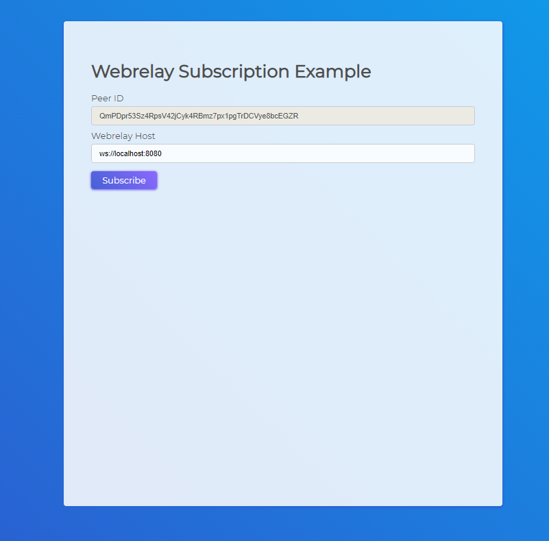

# Subscribing to your Webrelay in the Browser

This example will show you how to subscribe to your webrelay server from your client-side browser. After subscribing to the webrelay you will be able to forward OpenBazaar messages.




## Setup

This setup assumes you are running the OpenBazaar Webrelay on localhost + port 8080. If you need to update your host edit the "host" input.

```sh
> npm install
> npm start
```

After installing the dependencies you can run the example by opening up index.html in your local browser. 

## Special Thank Yous

Thank you to @hoffmabc and @jashot7 for their demos which helped save a lot of time putting this together. This project was meant to be a simplified demo and tutorial to help get developers started with the webrelay.

## Future Updates

This example project will be expanded in the future to include browser messaging, order handling, and more. The goal is to eventually develop a full browser node for OB.
