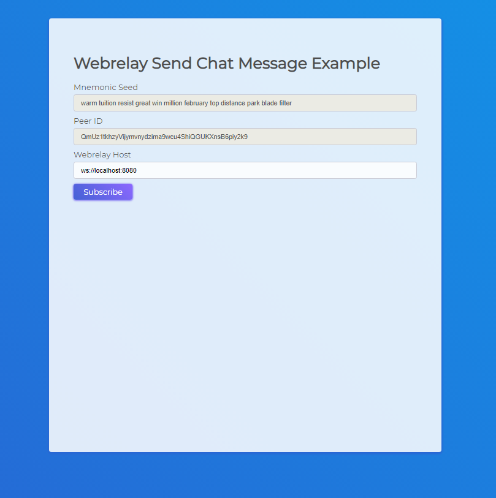

# Webrelay Send Chat Message Example

This example will show you how to message a vendor after authing to your webrelay. In the current example the recipient must have at least one listing publicly available in order to message them.



## Setup

This setup assumes you are running the OpenBazaar Webrelay on localhost + port 8080. 

```sh
> npm install
> npm start
```

After installing the dependencies you can run the example by opening up index.html in your local browser. 

## Special Thank Yous

Thank you to @hoffmabc and @jashot7 for their demos which helped save a lot of time putting this together. This project was meant to be a simplified demo and tutorial to help get developers started with the webrelay.


